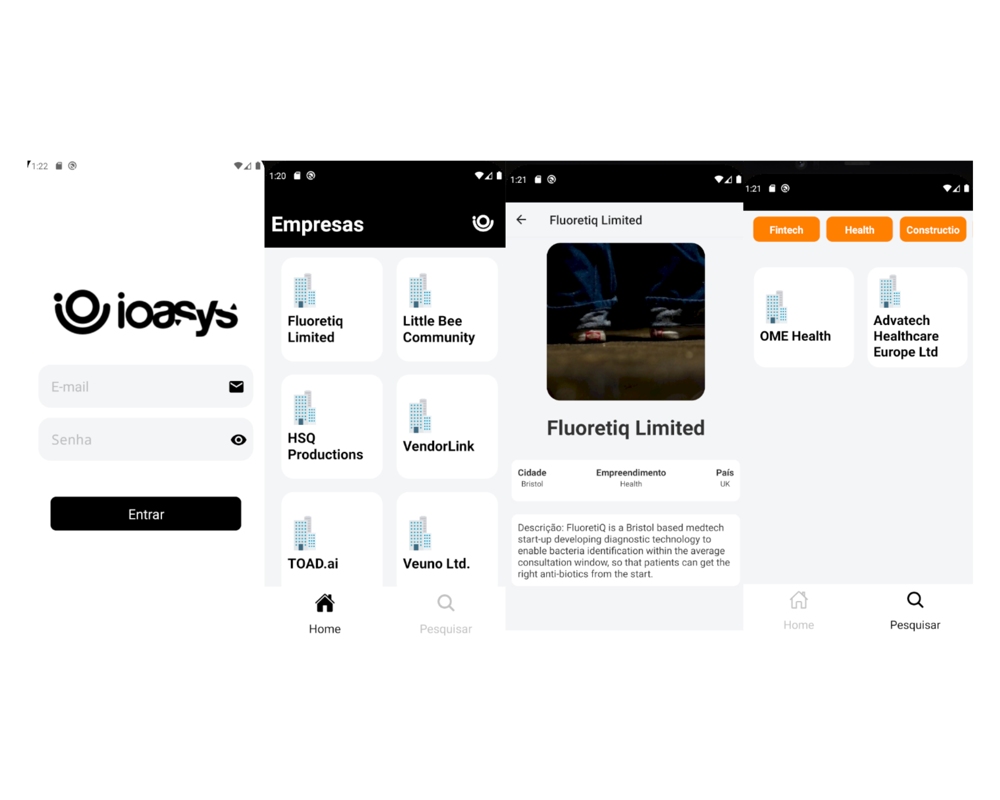

<h1 align="center">
  App Empresas
</h1>

<h4 align="center">Aplicação mobile desenvolvida para listar e visualizar informações de empresas da API da Ioasys</h4>

## 💬 Tecnologias
<ul>
  <li>React Native</li>
  <li>Javasricpt</li>
</ul>

## 💬 Bibliotecas utilizadas
<ul>
  <li>Redux.js -> Gerenciamento de estado da aplicação</li>
  <li>Redux-Saga -> Gerenciamento das actions </li>
  <li>Styled-Components -> Utilizado para estilização dos componentes </li>
  <li>React Navigation -> Utilizada para fazer as navegações da aplicação </li>
  <li>Axios -> Utilizado para realizar as chamadas a API </li>
  <li>react-native-size-matters -> Utilizado para dar uma melhor responsividade para os componentes </li>
  <li>react-native-vector-icons -> Utilizado para adicionar ícondes na aplicação </li>
</ul>

## 💬 Bibliotecas utilizadas para desenvolvimento
<ul>
  <li>Eslint -> Análise de código </li>
  <li>Reactotron -> Utilizado para debugar a aplicação </li>
  <li>Prettier -> Formatar código </li>
  <li>Editor config -> Estilos de codificação </li>
</ul>

## 💬 Funcionalidades
<ul>
  <li>Autenticação na API</li>
  <li>Listagem de empresas</li>
  <li>Listagem de empresas pelo filtro e nome</li>
  <li>Detalhamento da Empresa</li>
</ul>

## 💬 Dados para teste
<ul>
  <li>Login: testeapple@ioasys.com.br</li>
  <li>Senha: 12341234</li>
</ul>

## 🚀 Como executar
<ul>
  <li> Clone o repositório </li>
  <li> No diretório raiz do projeto, executar yarn para instalar dependências </li>
  <li> Executar **yarn android | ios** para rodar a aplicação usando emulador ou dispositivo físico </li>
</ul>

